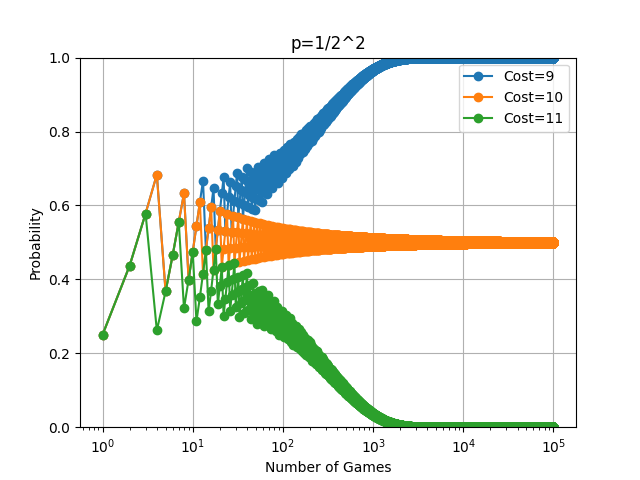
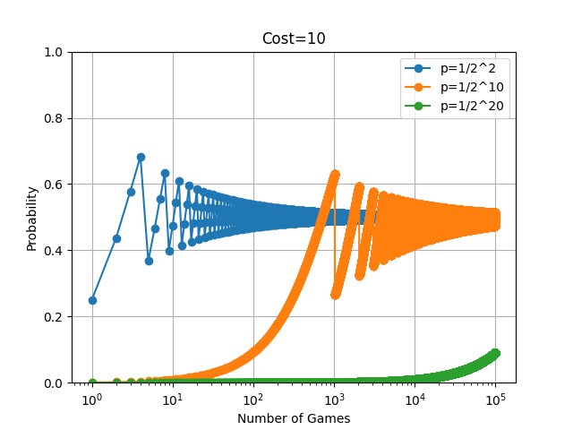

# St Petersburg Paradox

This project is used for paper analyzing the St. Petersburg Paradox.

<table>
  <tr>
    <td align="center">
      
      <br>Simple Game<br>with different cost
    </td>
    <td align="center">
      
      <br>Simple Game<br>with different probability
    </td>
    <td align="center">
      
      <br>St. Petersburg Game
    </td>
  </tr>
</table>

[한글 논문](https://tricolor-calliandra-b4f.notion.site/St-Petersburg-15f990798a6580eebf61f5d1b085ccff), [English Paper](https://tricolor-calliandra-b4f.notion.site/An-Interpretation-of-the-St-Petersburg-Paradox-using-a-Trial-Probability-of-Profit-Model-163990798a658097b078c51743483df1?pvs=74)

## Getting Started

1.  Clone the repository
    ```bash
    git clone https://github.com/kimkun07/St-Petersburg-Paradox.git
    cd St-Petersburg-Paradox
    ```
2.  Install required packages

    ```bash
    poetry install
    pip install -r requirements.txt # If not using poetry
    ```

3.  Run the program
    ```bash
    poetry run python -m st_petersburg_paradox.main
    python -m st_petersburg_paradox.main # If not using poetry
    ```

> [!CAUTION]
> pyinquirer 1.0.3 is incompatible with python 3.10 or above. Try updating pyinquirer if it has been updated, or modify pyinquirer code yourself. Check [Issue #198](https://github.com/CITGuru/PyInquirer/issues/198) for details.
